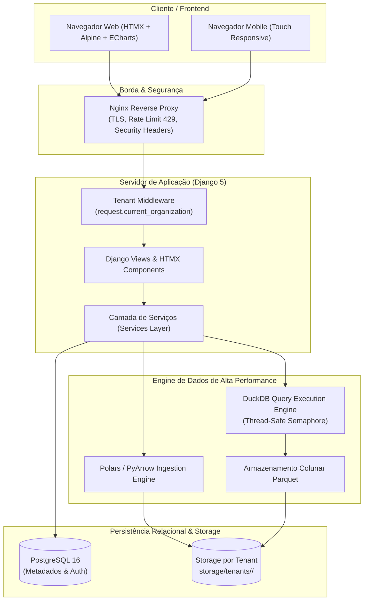
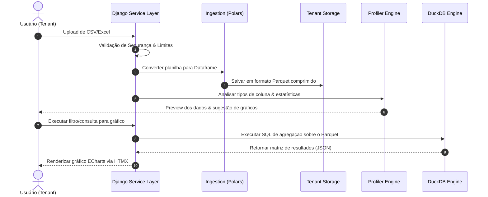

# Core Analytics — AI-Orchestrated No-Code Analytics SaaS

> **Plataforma SaaS de Analytics de Alta Performance construída com Django, Polars, DuckDB e Apache ECharts, 100% projetada e orquestrada via inteligência artificial com técnicas avançadas de governança de código.**

---

## 🎯 Sobre o Projeto

O **Core Analytics** é uma plataforma SaaS criada para resolver o problema de ingestão e visualização de dados sem a necessidade de ferramentas complexas de BI ou escrita de SQL. O usuário envia planilhas **Excel (.xlsx)** ou arquivos **CSV**, e a plataforma converte-os automaticamente para o formato **Parquet**, gera perfilagem estatística, sugere gráficos e permite a montagem de dashboards responsivos em minutos.

### 🌟 Destaques de Engenharia

- ⚡ **Engine Analytics de Ultra Performance:** Ingestão de planilhas com **Polars**, armazenamento colunar em **Parquet** e motor de consulta em memória com **DuckDB**, permitindo agregar milhões de linhas em milissegundos sem sobrecarregar o banco de dados relacional.
- 🔒 **Multi-Tenancy Rígido por Design:** Isolamento lógico e físico completo entre organizações. Todos os dados são segregados no sistema de arquivos por tenant (`storage/tenants/<org_id>/`) e filtrados estritamente na camada de serviço.
- 🤖 **Construção 100% Orquestrada por IA:** Desenvolvido através de um protocolo rigoroso de governança de agentes de IA (**AI Harness**), garantindo >900 testes unitários/integração automatizados, zero dívida técnica e compliance de segurança.
- 📱 **Mobile-First Data Visualization:** Dashboards responsivos com suporte a gestos touch, bottom sheets para filtros e adaptação dinâmica do Apache ECharts para dispositivos móveis.
- 🛡️ **Deploy Hardenizado & Operação Resiliente:** Infraestrutura Docker não-root, Nginx com rate-limiting customizado (HTTP 429), CSP restrita e sistema automatizado de backups criptografados offsite (S3/Spaces via `rclone crypt`).

---

## 📚 Documentação de Destaque

- [📑 **Estudo de Caso: Orquestração de IA**](docs/CASE_STUDY_AI_ORCHESTRATION.md) — Como guiamos a IA para construir um software pronto para produção.
- [💼 **Guia Executivo de Bolso**](docs/PORTFOLIO_EXECUTIVE_SUMMARY.md) — Pitch, diferenciais de engenharia e perguntas de entrevista.
- [🤖 **AI Harness Directives (`AGENTS.md`)**](AGENTS.md) — As regras estritas fornecidas à IA durante o desenvolvimento.

---

## 🏗️ Arquitetura do Sistema

---

## 🤖 Como a IA foi Orquestrada (AI Harness)

Um dos maiores diferenciais deste projeto foi o **método de desenvolvimento**. Em vez de usar IA para apenas gerar trechos isolados de código, o projeto usou um **sistema completo de governança para agentes de IA** (`AGENTS.md`).

### Protocolos de Governança Aplicados:

1. **Context Management Severo:** A IA recebia apenas o contexto necessário para cada entrega pequena e isolada, prevenindo alucinações em bases de código extensas.
2. **Quality Gates Automatizados:** Cada alteração proposta pela IA precisava passar por três portões antes de ser aceita:
   - `pytest` (Suíte completa com >900 testes sem falhas).
   - `python manage.py check` (Verificação de sanidade do Django).
   - `python manage.py makemigrations --check` (Consistência do modelo de dados).
3. **Zero Refatoração Oportunista:** A IA foi proibida de alterar arquivos fora do escopo da tarefa atual ou modificar contratos de API existentes sem autorização explícita.
4. **Security First Directives:** A IA foi configurada com regras invioláveis de segurança:
   - Proibido aceitar `organization_id` originado do cliente HTTP.
   - Obrigatoriedade de resolver a organização via usuário autenticado.
   - Proibido expor caminhos absolutos de arquivos, SQL bruto ou stack traces.

---

## ⚡ Pipeline de Processamento de Dados

---

## 🔒 Segurança e Resiliência Multi-Tenant

- **Isolamento de Arquivos:** Os datasets de cada empresa ficam armazenados em subdiretórios únicos baseados no UUID da organização (`storage/tenants/<org_id>/datasets/<dataset_id>/current.parquet`).
- **Sessões DuckDB Isoladas & Thread-Safe:** A engine DuckDB roda em um ambiente controlado por semáforo global (`services/duckdb_session.py`), garantindo limites de memória (`memory_limit`) e concorrência pré-definida (`DUCKDB_THREADS=1`) para evitar estouro de recursos na VPS.
- **Proteção contra Brute Force e Rate Limit:** Zonas de limitação de requisições no Nginx (`limit_req`) respondendo HTTP 429 com header `Retry-After: 1`.
- **Embeds Assinados:** Dashboards compartilhados externamente utilizam tokens criptográficos de acesso único e restrição de origem (`allowlist`), sem expor a sessão do usuário.

---

## 🛠️ Stack Tecnológica

| Camada | Tecnologia |
| :--- | :--- |
| **Linguagem Backend** | Python 3.12 |
| **Framework Web** | Django 5 |
| **Engine de Ingestão** | Polars & PyArrow |
| **Engine OLAP / Analytics** | DuckDB |
| **Banco de Dados Relacional** | PostgreSQL 16 |
| **Frontend / UI** | Django Templates, HTMX, Alpine.js |
| **Visualização de Dados** | Apache ECharts |
| **Contêineres & Infra** | Docker, Docker Compose, Nginx |
| **Deploy & Cloud** | VPS Ubuntu 24.04, TLS Let's Encrypt |

---

## 📄 Licença e Uso

Este repositório serve como uma demonstração pública de **arquitetura, padrões de engenharia de software e orquestração de Inteligência Artificial**. O código comercial completo e o produto em produção são mantidos sob licença proprietária privada.

---
*Projetado e orquestrado por Samuel Werplotz com assistência de Agentes de IA.*
